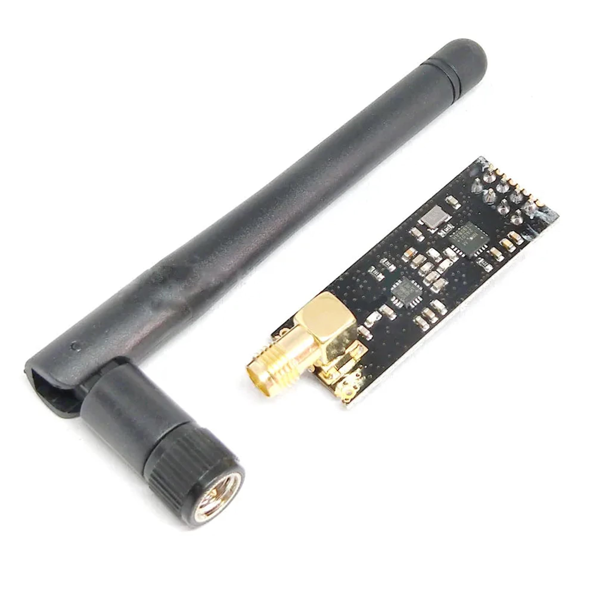
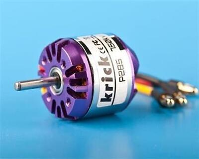
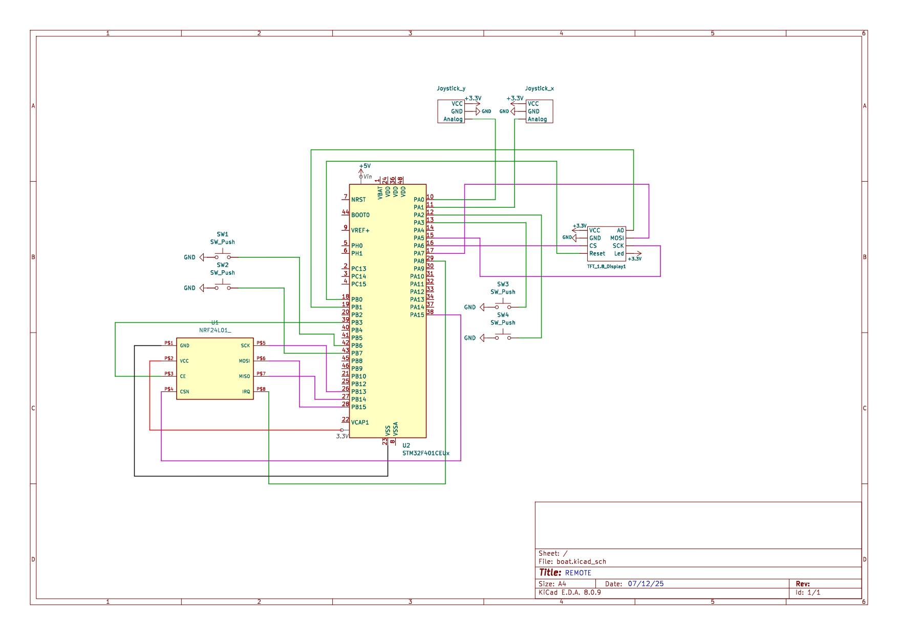

# FISHING BOAT

The goal of this project is to create a boat capable of assisting with fishing.  
I built it for fun and for my father, who goes fishing from time to time.

The mission of the boat is simple: **drop a fishing line and bait a specific area**.  
To achieve this purpose, I used the following components:

- **Nucleo STM32F446RE** : A powerful 32-bit microcontroller running up to 180 MHz, offering many connectivity interfaces and an FPU, ideal for a project involving multiple modules.

  

- **nRF24L01** : A compact 2.4 GHz transceiver module capable of long-range wireless communication (up to 1 km with an antenna).

  

- **Krick p285** : A 750 KV brushless motor providing good torque and efficiency.

  

---

## Electric Schema

This section describes the overall electrical design of the fishing boat.  
The goal is to ensure **stable power distribution**, **reliable wireless communication**, and **safe motor control**.

The electrical system includes the following parts:

- **Power System:**  
  Two mains batteries are connected in parralel and powers both the motor and the electronic boards.  
  One of the ESC's BEC give the STM32 an ekectrical power supply and the STM32 give a stable 3.3V to the nRF24.

- **Control Unit (STM32F446RE):**  
  The microcontroller serves as the central controller of the boat.  
  It generates **PWM signals** to command the brushless motor through an ESC (Electronic Speed Controller).  
  It also manages communication with the nRF24L01 via the **SPI bus**.

- **Wireless Link (nRF24L01):**  
  The module is connected through **SPI** (MOSI, MISO, SCK, CSN) and a **CE** pin to switch between TX and RX modes.  
  A capacitor (10µF to 100µF) is placed between VCC and GND to ensure stable operation and avoid signal dropouts.

- **Motor & ESC:**  
  The brushless **Krick p285 — 750 KV** motor is driven by an ESC that receives throttle commands from the STM32.  
  The ESC is powered directly from the main battery to avoid drawing too much current from the microcontroller’s regulator.

- **BS170 Transistors** : N-channel enhancement mode MOSFET with Gate Threshold Voltage of 2-4V, perfect to turn it on with a gpio output of 3.3V. All of the leds are
connected to the drain pin as well as a headlight.

  

