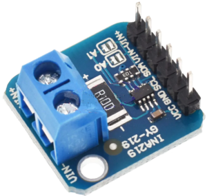

# FISHING BOAT

Le but de ce projet est de créer un bateau télécommandé capable de réaliser certaines tâches tel que larguer une ligne ou répondre à des commandes 
à plus de 500m dans des conditions idéales. Ce projet a été l'occasion d'apprendre de nombreuses choses tel que la création de drivers, le design de schéma électrique et d'approfondir mes connaissances sur les protocoles de communication tel que **SPI/I2C** et l'UART pour le debug. 
J'ai pû aussi y mettre en oeuvre de bonnes pratiques de sécurité et de programmation embarqué que j'ai eu l'occasion d'apprendre à l'université mais aussi en autodidacte.

## Liste du matériel côté bateau

- **Nucleo STM32F446RE** : Microcontrôleur basé sur un Cortex-M4 à plus de 180Mhz, interfaces SPI, I2C etc... 
parfait pour mon cas d'usage.

<p align="center">
  
</p>

- **nRF24L01** : Module radio 2,4 GHz compact et basse consommation permettant une communication sans fil rapide et fiable jusqu’à plusieurs centaines de mètres.

<p align="center">
  
</p>

- **Krick p285** : Moteur brushless avec un bon couple, 750Kv.

<p align="center">
  
</p>

- **BS170 Transistors** : MOSFET à Canal N avec une tension de seuil de grille de 2 à 4 V, parfait pour être activé par une sortie GPIO de 3,3 V. 
Toutes les LED sont connectées à la broche de drain, ainsi qu’un phare.

<p align="center">
  
</p>

- **Ina219** : Capteur de courant et de tension et communication par I2C.


<p align="center">
  
</p>

J'ai choisi des batteries 3S pour fonctionner avec les moteurs de façon optimale sachant que leur marge est de 6V-14V et des leds 12V 
compatible avec mes batteries.

## Schéma électrique bateau

<p align="center">
  
</p>

Ce schéma montre l'entièreté des connexions électriques du bateau.  
J'ai personellement utilisé 2 batteries 3S 3000mAH en parallèle pour doubler la capacité et passer à **6000mAH**. La sortie du branchement alimente l'ensemble du système. Une partie des composants est alimenté par la sortie du **BEC** des **2 ESC** en 5V/3A notamment :  
- Les 3 servos moteur 
- La nucleo via sa **broche Vin** 

Les transistors agissent en tant qu'interrupteur sur **3 composants** :  
- Les **leds** si la commande est reçue par radio
- Le **phare** si la commande est reçue
- Les **ventilateurs**, qui ne s'allument que quand les moteurs tournent pour économiser de l'énergie.

## Architecture logicielle du bateau

La **carte Nucleo STM32** agit comme le cerveau du bateau.
Elle réceptionne les commandes envoyées par la manette (via radio), les interprète, puis les traduit en actions directes : commande des moteurs, des servos, et gestion des fonctions annexes (télémétrie, sécurité, éclairage).

Pour assurer un fonctionnement **fluide, réactif et fiable**, le système repose sur **FreeRTOS**, un système d’exploitation temps réel. Voici les tâches principales:    
- **ListeningNrfTask** :  
Tâche dédiée à l'écoute permanente de la réception des messages via radio. Elle traite chaque type de message independamment en fonction du header reçu.  
-> **AA (Analog)**, réception des données analogiques du joystick, ces données sont envoyées dans une **Queue** (file) sous la forme d'une structure.  
-> **BB (Bouton)**, réception des données des boutons. Par exemple allummer le phare, les leds ou les servos.  
-> **CC (Voltage)**, réception de la demande d'envoi du niveau de batterie. À la réception, le bateau passe le nrf24l01 en mode **sender**, envoie la batterie courante et repasse en **listener**. 

- **MotorTask** :  
Tâche dédiée au contrôle des moteurs. Quand un message est arrivé sur la **File JoyQueue** qui se présente comme suit:  
```c
typedef struct
{
    uint8_t x;          // Joystick X (direction)
    uint8_t y;          // Joystick Y (vitesse)
    uint32_t tick;      // Tick RTOS de réception
} JoyCmd_t;
```


# Homemade remote controller

