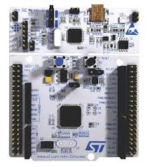
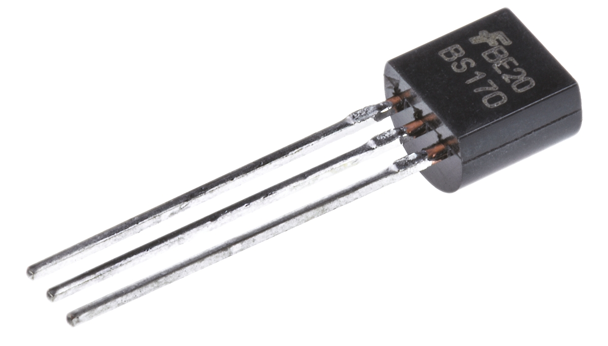
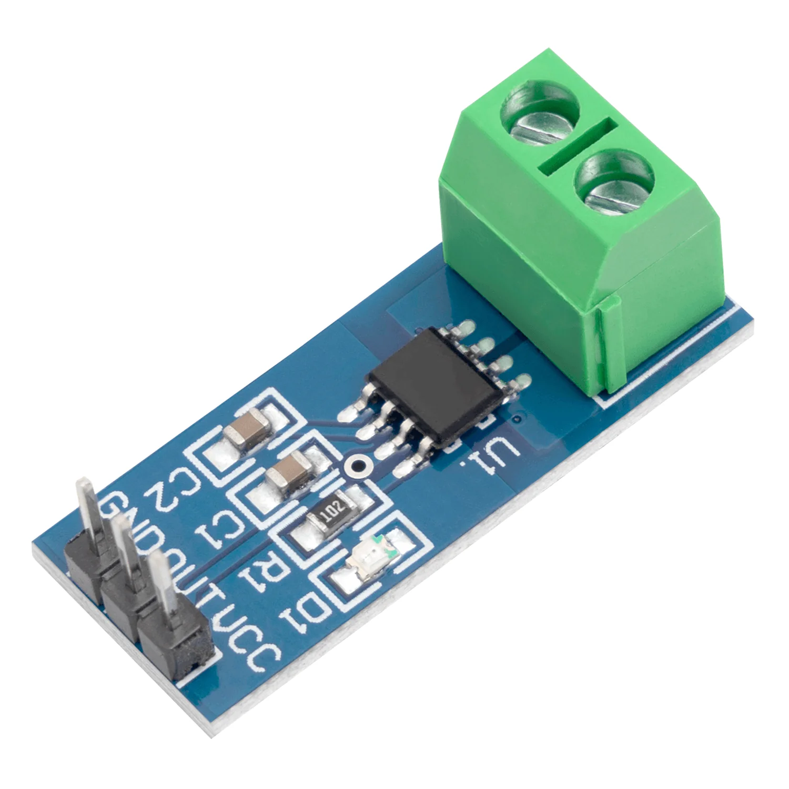
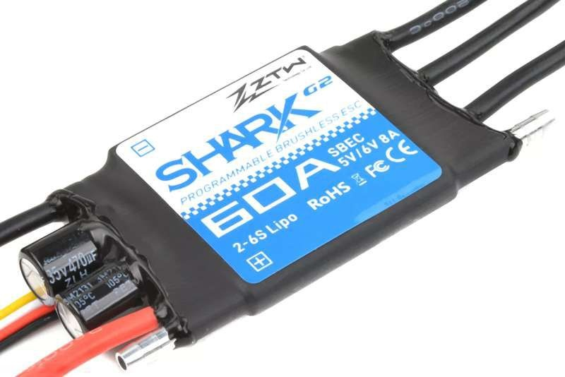
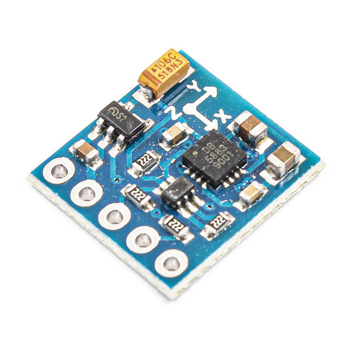
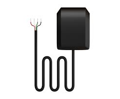
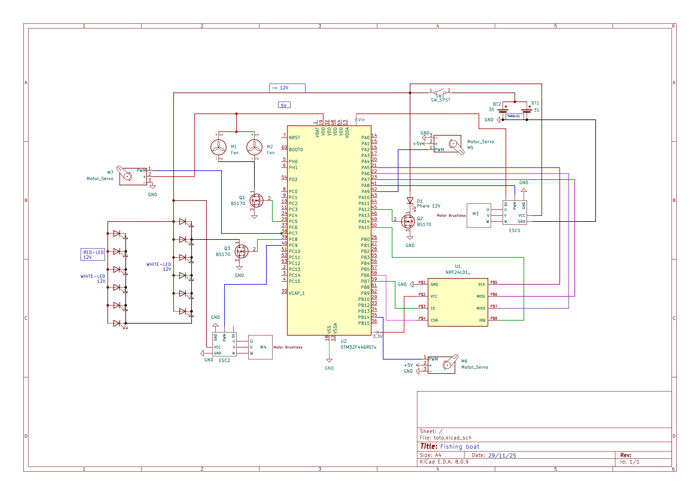

# FISHING BOAT

Le but de ce projet est de créer un bateau télécommandé capable de réaliser certaines tâches tel que larguer une ligne ou répondre à des commandes 
à plus de 500m dans des conditions idéales. Ce projet a été l'occasion d'apprendre de nombreuses choses tel que la création de drivers, le design de schéma électrique et d'approfondir mes connaissances sur les protocoles de communication tel que **SPI/I2C** et l'UART pour le debug. 
J'ai pû aussi y mettre en oeuvre de bonnes pratiques de sécurité et de programmation embarqué que j'ai eu l'occasion d'apprendre à l'université mais aussi en autodidacte.

## Liste du matériel côté bateau

- **Nucleo STM32F446RE** : Microcontrôleur basé sur un Cortex-M4 à plus de 180Mhz, interfaces SPI, I2C etc... 
parfait pour mon cas d'usage.

<p align="center">
  
</p>

- **nRF24L01** : Module radio 2,4 GHz compact et basse consommation permettant une communication sans fil rapide et fiable jusqu’à plusieurs centaines de mètres.

<p align="center">
  
</p>

- **Krick p285** : Moteur brushless avec un bon couple, 750Kv.

<p align="center">
  
</p>

- **BS170 Transistors** : MOSFET à Canal N avec une tension de seuil de grille de 2 à 4 V, parfait pour être activé par une sortie GPIO de 3,3 V. 
Toutes les LED sont connectées à la broche de drain, ainsi qu’un phare.

<p align="center">
  
</p>

- **Ina219** : Capteur de courant et de tension et communication par I2C.


<p align="center">
  
</p>

- **ESC Bidirectionnel 60A** : ESC de type **forward and backward**, indispensable pour un bateau. J'ai choisi cet ESC pour son prix, environ **20€** sur certains sites mais aussi pour sa bonne réputation parmi la communauté.

<p align="center">
  
</p>

- **Boussole magnétique GY271** : Boussole magnétique sur 3 axes, utilisé dans le pilote automatique.

<p align="center">
  
</p>

- **GPS Ebyte GN04G** : GPS étanche, communication en UART, précis au mètre près.
<p align="center">
  
</p>

J'ai choisi des batteries 3S pour fonctionner avec les moteurs de façon optimale sachant que leur marge est de 6V-14V et des leds 12V.
compatible avec mes batteries.

## Schéma électrique bateau

<p align="center">
  
</p>

Ce schéma montre l'entièreté des connexions électriques du bateau.  
J'ai personellement utilisé 2 batteries 3S 3000mAH en parallèle pour doubler la capacité et passer à **6000mAH**. La sortie du branchement alimente l'ensemble du système. Une partie des composants est alimenté par la sortie du **BEC** des **2 ESC** en 5V/3A notamment :  
- Les 3 servos moteur 
- La nucleo via sa **broche Vin** 

Les transistors agissent en tant qu'interrupteur sur **3 composants** :  
- Les **leds** si la commande est reçue par radio
- Le **phare** si la commande est reçue
- Les **ventilateurs**, qui ne s'allument que quand les moteurs tournent pour économiser de l'énergie.

SCHEMA PAS A JOUR

## Architecture logicielle du bateau


La **carte Nucleo STM32** agit comme le cerveau du bateau.
Elle réceptionne les commandes envoyées par la manette (via radio), les interprète, puis les traduit en actions directes : commande des moteurs, des servos, et gestion des fonctions annexes (télémétrie, sécurité, éclairage).

Pour assurer un fonctionnement **fluide, réactif et fiable**, le système repose sur **FreeRTOS**, un système d’exploitation temps réel. Pour permettre à mon système d'être entièrement fonctionnel, j'ai créer un ensemble de tâches avec un but spécifique défini dans le fichier [rtos_tack.c](Core/Src/rtos_task.c), voici une explication des principales:  

- **StartDefaultTask** :  
Lors du démarrage, cette tâche s'occupe d'envoyer la première trame radio vers la mannete, qui contient la batterie actuelle du bateau pour avoir un affichage temps réel et direct et ainsi connaitre le temps de voyage disponible. Ensuite, le nrf passe en mode écoute et la tâche s'occupe d'envoyer le flag de réveil à l'ensemble des autres tâches. J'ai choisi cette approche car j'ai estimé nécessaire et obligatoire d'avoir une idée de l'état de la batterie lors du démarrage.  

- **CompassTask** :  

La tâche **CompassTask** se charge de mettre à jour les valeurs du cap du bateau en parallèle. Je me suis basé sur la bibliothèque suivante [Lien Github](https://github.com/Granddyser/QMC5883P) écrite en cpp que j'ai fais traduire en C. Dans l'état actuel je n'utilise seulement le heading mais l'état des 3 axes pourra être utiliser dans le futur. La carte communique via un bus I2C. Avant d'utiliser la puce il est nécessaire de la calibrer.

- **WatchDogNrfTask** :  

Pour s'assurer de la communication constante entre l'utilisateur/manette et le bateau j'ai décidé de créer un système capable de détecter les pertes de connexion en temps réel. Je me suis basé sur la fonction **osThreadFlagsWait()** qui permet l'attente d'un flag sans prendre de CPU. Ce flag est donné à chaque réception de données radio. Les valeurs du joystick sont constamment envoyé pour permettre une rapidité d'action accrue, ainsi à chaque réception le flag est envoyé et le bateau et l'utilisateur savent que la connexion est interrompu. Si c'est le cas, les leds se mettent à clignoter rapidement en guise de signal, et le bateau entre dans le mode **non connecté**. Dans ce mode il fait demi tour tout seul jusqu'au point de départ ou jusqu'à une prochaine réception radio. 

- **MotorTask** :  

Pour faire tourner les 2 moteurs brushless, il faut envoyer des signaux **PWM** à chaque **ESC**. L'intérêt d'avoir des ESC bidirectionnel est qu'ils peuvent tourner dans les 2 sens. Élément essentiel car sans ça, le bateau ne peut pas tourner sur lui même et nécessite plusieurs mètres pour faire demi tour. Pour se faire, j'ai du créer un équilibre entre chaque moteur en fonction des valeurs des joysticks envoyés par la manette. L'ensemble du code est documenté ici : [Code moteur](Core/Src/motor.c).  
La tâche attend donc ces valeurs avec la fonction **xQueueReceive()**. Message sous forme de structure de ce type :  

```c
typedef struct
{
    uint8_t x;          // Joystick X (direction)
    uint8_t y;          // Joystick Y (vitesse)
    uint32_t tick;      // Tick RTOS de réception
} JoyCmd_t;
``` 
La file est remplie à chaque réception de données joysticks. 

- **ListeningNrf** :  

 C'est la tâche la plus importante du système. Elle écoute en permanence les communications de la manette et exécute les actions en conséquences. Pour se faire, elle lit le header du message, chaque message est constitué de la sorte **HEADER|DATA**.  
 Il y'a 3 actions possible contrôlable directement par l'utilisateur.  
 **Header -> 0xAA** : Réception des données analogiques des joysticks, remplissage de la structure et de la file avec la structure **(Joy_Cmd_t)** ci dessus.  
 **Header -> 0xBB** : Réception de la valeur d'un bouton, la, appel de la commande **process_command** qui se charge d'effectuer l'action conséquente, par exemple allumage des leds ou du phare.  
 **Header -> 0xCC** : Réception de la commande d'envoi de la batterie. Pour permettre une synchronisation temps réel sur l'envoi de la batterie, le bateau attend l'ordre de la manette. La manette passe en réception et le bateau en émetteur. Après l'échange elle ré inverse les rôles et le bateau se remet en écoute constante. Cette commande arrive toutes les **3 secondes**.

- **GpsTask** :  
La tâche du GPS permet d'avoir les coordonnées, l'azimuth et la vitesse du bateau en temps réel. Le GPS communique via UART et utilise la fonction **HAL_UARTEx_ReceiveToIdle_DMA** pour récupérer les informations. Le DMA est utilisé pour obtenir les données sans utilisé le CPU. **ReceiveToIdle** permet au **NVIC** de déclencher une interruption lorsque le GPS à fini d'envoyer des données et se met en état IDLE et n'émet plus pendant un certain temps. Quand cette interruption est déclenché, la tâche GPS en est notifié via le callback **HAL_UARTEx_RxEventCallback** et parse les données GPS. Je ne m'intéresse qu'aux messages **RMC** de ce format : $GPRMC,100646.000,A,3109.9704,N,12123.4219,E,0.257,335.62,291216,,,A*59. Il contient la latitude, longitude, groundspeed et l'azimuth.  

## Pilote automatique
Pour permettre au bateau de se déplacer tout seul ou pour lui permettre d'effectuer des missions sans aucune intervention, je vais créer un système d'autopilot basé sur le compas et le gps. Pour combiner les 2 sources de données je suis en train de travailler sur les filtres de Kalman pour les combiner et avoir un rendu plus fiable. Les coordonnées vont pouvoir être rentré directement sur la manette et transmise au bateau pour s'y diriger. EN COURS 